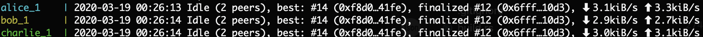

# Table of contents

* [Install and update Rust, Substrate, and Subkey](#chapter-ca1234)
* [Example "dev" development PoS testnet with single nodes](#chapter-ca9336)
* [Example "local" PoS testnet with multiple nodes](#chapter-f21efd)
* [Live "brickable" PoS testnet (with multiple nodes)](#chapter-ff1234)
* [Live "harbour" PoS testnet (with multiple nodes)](#chapter-f023e2)
* [Live "westlake" PoS mainnet (with multiple nodes)](#chapter-f023ff)
* [Interact with blockchain using Polkadot.js Apps UI](#chapter-6d9058)

## Install and update: Rust, Substrate, Wasm, and Subkey <a id="chapter-ca1234"></a>

* Install and update Build Dependencies by following Substrate Developer Hub instructions https://substrate.dev/docs/en/knowledgebase/getting-started/#1-build-dependencies for your specific operating system

* Install and update Rust, Substrate, Wasm:

```bash
wget -O - https://sh.rustup.rs | sh -s -- -y && \
. ~/.cargo/env && \
PATH=$PATH:~/.cargo/bin && \
./scripts/init.sh && \
cargo version && \
rustc --version
```

* Optionally install Subkey from https://substrate.dev/docs/en/knowledgebase/integrate/subkey

## Example "dev" development PoS testnet (with single node) <a id="chapter-f21efd"></a>

### Intro

The development testnet only requires a single node to produce and finalize blocks.

### Run on Local Machine

* Fork and clone the repository

* Install/update dependencies as described [here](#chapter-ca1234)

* Build the WebAssembly binary from all code.

```bash
cargo build --release
```

* Purge the chain (remove relevant existing blockchain testnet database blocks and keys)

```bash
rm -rf /tmp/polkadot-chains
```

Alternatively run the following, and repeat replacing `alice`, ... `eve`, and `node-1`, ... `node-5`:
```bash
./target/release/datahighway purge-chain --dev --base-path /tmp/polkadot-chains/alice
```

* Connect to development testnet (`--chain development` is abbreviated `--dev`)

```bash
./target/release/datahighway \
  --base-path /tmp/polkadot-chains/alice \
  --name "Data Highway Development Chain" \
  --dev \
  --telemetry-url "wss://telemetry.polkadot.io/submit/ 0" \
  -lruntime=debug
```

## Example "local" PoS testnet (with multiple nodes) <a id="chapter-f21efd"></a>

### Intro

Run a multiple node PoS testnet on your local machine with built-in keys (Alice, Bob, Charlie) using a custom Substrate-based blockchain configuration using multiple terminals windows.
* Configure and import custom raw chain definition
* Use default accounts Alice, Bob, and Charlie as the three initial authorities of the genesis configuration that have been endowed with testnet units that will run validator nodes
* **Important**: Since we are using GRANDPA where you have authority set of size 4, it means you need 3 nodes running in order to **finalize** the blocks that are authored. (Credit: @bkchr Bastian Köcher)

### Run on Local Machine (without Docker) (Alice, Bob, Charlie, Dave, Eve)

This approach is similar to that described in the official Substrate docs [here](https://substrate.dev/docs/en/tutorials/start-a-private-network/alicebob).
#### Fetch repository and dependencies

* Fork and clone the repository

* Install/update dependencies as described [here](#chapter-ca1234)

#### Build runtime code

* Build the WebAssembly binary from all code.

```bash
cargo build --release
```

> Remember to purge the chain state if you change anything (database and keys)

```bash
rm -rf /tmp/polkadot-chains/
```

In each terminal we will connect using the "local" chain specification

> Other testnet chains are specified in src/chain_spec.rs (i.e. dev, local, or harbour).

#### Terminal 1

Run Alice's bootnode using the raw chain definition file that was generated

Note that it should work whether you use `--chain local \` or `--chain ./node/src/chain-built/chain_def_local.json \` below. See section "Create custom blockchain configuration" and https://substrate.dev/docs/en/tutorials/start-a-private-network/customspec for when we would generate the chain spec and definition .json file when we have a custom chain (e.g. brickable, harbour and westlake)

```bash
./target/release/datahighway --validator \
  --unsafe-ws-external \
  --unsafe-rpc-external \
  --rpc-cors=all \
  --base-path /tmp/polkadot-chains/alice \
  --chain local \
  --node-key 88dc3417d5058ec4b4503e0c12ea1a0a89be200fe98922423d4334014fa6b0ee \
  --alice \
  --port 30333 \
  --ws-port 9944 \
  --rpc-port 9933 \
  --telemetry-url "wss://telemetry.polkadot.io/submit/ 0" \
  --execution=native \
  -lruntime=debug \
  --rpc-methods=Unsafe
```

When the node has started, copy the libp2p local node identity of the node, and paste in the `bootNodes` of chain_def_local.json for starting other nodes with, and add it to the list of available bootnodes in chain_spec.rs, or just provide the value to `--bootnodes` when starting other nodes.

* Notes:
  * Alice's Substrate-based node on default TCP port 30333
  * Her chain database stored locally at `/tmp/polkadot-chains/alice`
  * In this example, Bootnode ID of her node is `Local node identity is: 12D3KooWKS7jU8ti7S5PDqCNWEj692eUSK3DLssHNwTQsto9ynVo` (peer id), which is generated from the `--node-key` value specified below and shown when the node is running. In **production** you should NOT share the `--node-key` as other nodes could use it and you might get slashed. Note that `--alice` provides Alice's session key that is shown when you run `subkey inspect --scheme ed25519 "//Alice"`, alternatively you could provide the private key that is necessary to produce blocks with `--key "bottom drive obey lake curtain smoke basket hold race lonely fit walk//Alice"`. In production the session keys are provided to the node using RPC calls `author_insertKey` and `author_rotateKeys`. If you explicitly specify a `--node-key` (i.e. `--node-key 88dc3417d5058ec4b4503e0c12ea1a0a89be200fe98922423d4334014fa6b0ee`) when you start your validator node, the logs will still display your peer id with `Local node identity is: Qxxxxxx`, and you could then include it in the chain_spec_local.json file under "bootNodes". Also the peer id is listed when you go to view the list of full nodes and authority nodes at Polkadot.js Apps https://polkadot.js.org/apps/#/explorer/datahighway

#### Terminal 2

Run Bob's Substrate-based node on a different TCP port of 30334, and with his chain database stored locally at `/tmp/polkadot-chains/bob`. We'll specify a value for the `--bootnodes` option that will connect his node to Alice's bootnode ID on TCP port 30333. Note that in **production** you might be running these on different servers so you could just use the same ports:

```bash
./target/release/datahighway --validator \
  --unsafe-ws-external \
  --unsafe-rpc-external \
  --rpc-cors=all \
  --base-path /tmp/polkadot-chains/bob \
  --bootnodes /ip4/127.0.0.1/tcp/30333/p2p/12D3KooWKS7jU8ti7S5PDqCNWEj692eUSK3DLssHNwTQsto9ynVo \
  --chain local \
  --bob \
  --port 30334 \
  --ws-port 9945 \
  --rpc-port 9934 \
  --telemetry-url "wss://telemetry.polkadot.io/submit/ 0" \
  --execution=native \
  -lruntime=debug \
  --rpc-methods=Unsafe
```

> Important: Since in GRANDPA you have authority set of size 4, it means you need 3 nodes running in order to **finalize** the blocks that are authored. (Credit: @bkchr Bastian Köcher)

#### Terminal 3

Run Charlie's Substrate-based node on a different TCP port of 30335, and with his chain database stored locally at `/tmp/polkadot-chains/charlie`. We'll specify a value for the `--bootnodes` option that will connect his node to Alice's bootnode ID on TCP port 30333:

```bash
./target/release/datahighway --validator \
  --unsafe-ws-external \
  --unsafe-rpc-external \
  --rpc-cors=all \
  --base-path /tmp/polkadot-chains/charlie \
  --bootnodes /ip4/127.0.0.1/tcp/30333/p2p/12D3KooWKS7jU8ti7S5PDqCNWEj692eUSK3DLssHNwTQsto9ynVo \
  --chain local \
  --charlie \
  --port 30335 \
  --ws-port 9946 \
  --rpc-port 9935 \
  --telemetry-url "wss://telemetry.polkadot.io/submit/ 0" \
  --execution=native \
  -lruntime=debug \
  --rpc-methods=Unsafe
```

Note: The chain_spec.rs file that you used to generate the chain definition with may already have the
bootnode details specified to connect to.

#### Terminal 4

Run Dave's node using different ports.

```bash
./target/release/datahighway --validator \
  --unsafe-ws-external \
  --unsafe-rpc-external \
  --rpc-cors=all \
  --base-path /tmp/polkadot-chains/dave \
  --bootnodes /ip4/127.0.0.1/tcp/30333/p2p/12D3KooWKS7jU8ti7S5PDqCNWEj692eUSK3DLssHNwTQsto9ynVo \
  --chain local \
  --dave \
  --port 30336 \
  --ws-port 9947 \
  --rpc-port 9936 \
  --telemetry-url "wss://telemetry.polkadot.io/submit/ 0" \
  --execution=native \
  -lruntime=debug \
  --rpc-methods=Unsafe
```

#### Terminal 5

Run Eve's node using different ports.

```bash
./target/release/datahighway --validator \
  --unsafe-ws-external \
  --unsafe-rpc-external \
  --rpc-cors=all \
  --base-path /tmp/polkadot-chains/eve \
  --bootnodes /ip4/127.0.0.1/tcp/30333/p2p/12D3KooWKS7jU8ti7S5PDqCNWEj692eUSK3DLssHNwTQsto9ynVo \
  --chain local \
  --eve \
  --port 30337 \
  --ws-port 9948 \
  --rpc-port 9937 \
  --telemetry-url "wss://telemetry.polkadot.io/submit/ 0" \
  --execution=native \
  -lruntime=debug \
  --rpc-methods=Unsafe
```

* Note: On DataHighway Harbour Testnet, the peer bootnode ID (node ID) that should be included in the .env file is different since a different node-key is used. On DataHighway Local Testnet we use node ID of `12D3KooWKS7jU8ti7S5PDqCNWEj692eUSK3DLssHNwTQsto9ynVo`, which is included in the chain_spec.rs

* Check that the chain is finalizing blocks (i.e. finalized is non-zero `main-tokio- INFO substrate  Idle (2 peers), best: #3 (0xaede…b8d9), finalized #1 (0x4c69…f605), ⬇ 3.3kiB/s ⬆ 3.7kiB/s`)

* Note that in this [commit](https://github.com/DataHighway-DHX/node/pull/140/commits/63f81c4e00e360c6df8549b6c870a17f9719f58b) we added ImOnline and AuthorityDiscovery, as well as added Dave, Eve, and Ferdie
as authorities in the chain_spec.rs.
So you **must** run all these validators before blocks will **finalize**: Alice, Bob, Charlie, Dave, Eve

* Generate session keys for Alice
```bash
$ subkey inspect --scheme ed25519 "//Alice"
Secret Key URI `//Alice` is account:
  Secret seed:      0xabf8e5bdbe30c65656c0a3cbd181ff8a56294a69dfedd27982aace4a76909115
  Public key (hex): 0x88dc3417d5058ec4b4503e0c12ea1a0a89be200fe98922423d4334014fa6b0ee
  Account ID:       0x88dc3417d5058ec4b4503e0c12ea1a0a89be200fe98922423d4334014fa6b0ee
  SS58 Address:     5FA9nQDVg267DEd8m1ZypXLBnvN7SFxYwV7ndqSYGiN9TTpu

$ subkey inspect --scheme sr25519 "//Alice"//aura
Secret Key URI `//Alice//aura` is account:
  Secret seed:      0x153d8db5f7ef35f18a456c049d6f6e2c723d6c18d1f9f6c9fbee880c2a171c73
  Public key (hex): 0x408f99b525d90cce76288245cb975771282c2cefa89d693b9da2cdbed6cd9152
  Account ID:       0x408f99b525d90cce76288245cb975771282c2cefa89d693b9da2cdbed6cd9152
  SS58 Address:     5DXMabRsSpaMwfNivWjWEnzYtiHsKwQnP4aAKB85429ZQU6v

$ subkey inspect --scheme sr25519 "//Alice"//babe
Secret Key URI `//Alice//babe` is account:
  Secret seed:      0x7bc0e13f128f3f3274e407de23057efe043c2e12d8ed72dc5c627975755c9620
  Public key (hex): 0x46ffa3a808850b2ad55732e958e781146ed1e6436ffb83290e0cb810aacf5070
  Account ID:       0x46ffa3a808850b2ad55732e958e781146ed1e6436ffb83290e0cb810aacf5070
  SS58 Address:     5Dfo9eF9C7Lu5Vbc8LbaMXi1Us2yi5VGTTA7radKoxb7M9HT

$ subkey inspect --scheme sr25519 "//Alice"//imonline
Secret Key URI `//Alice//imonline` is account:
  Secret seed:      0xf54dc00d41d0ea7929ac00a08ed1e111eb8c35d669b011c649cea23997f5d8d9
  Public key (hex): 0xee725cf87fa2d6f264f26d7d8b84b1054d2182cdcce51fdea95ec868be9d1e17
  Account ID:       0xee725cf87fa2d6f264f26d7d8b84b1054d2182cdcce51fdea95ec868be9d1e17
  SS58 Address:     5HTME6o2DqEuoNCxE5263j2dNzFGxspeP8wswenPA3WerfmA

$ subkey inspect --scheme ed25519 "//Alice"//grandpa
Secret Key URI `//Alice//grandpa` is account:
  Secret seed:      0x03bee0237d4847732404fde7539e356da44bce9cd69f26f869883419371a78ab
  Public key (hex): 0x6e2de2e5087b56ed2370359574f479d7e5da1973e17ca1b55882c4773f154d2f
  Account ID:       0x6e2de2e5087b56ed2370359574f479d7e5da1973e17ca1b55882c4773f154d2f
  SS58 Address:     5EZAkmxARDqRz5z5ojuTjacTs2rTd7WRL1A9ZeLvwgq2STA2
```

Note: AuthorityDiscovery (audi) is sr25519, but it is not a session key. The others are mentioned here https://wiki.polkadot.network/docs/en/learn-keys#session-keys

#### Terminal 4 (Optional)

* Add session keys for account(s) to be configured as authorities (validators). Run cURL to insert session key for each key type (i.e. "aura"), by providing the associated secret key, and associated Public key (hex)
```bash
curl -vH 'Content-Type: application/json' --data '{ "jsonrpc":"2.0", "method":"author_insertKey", "params":["aura", "", "0x408f99b525d90cce76288245cb975771282c2cefa89d693b9da2cdbed6cd9152"],"id":1 }' 127.0.0.1:9933
curl -vH 'Content-Type: application/json' --data '{ "jsonrpc":"2.0", "method":"author_insertKey", "params":["babe", "//Alice//babe", "0x46ffa3a808850b2ad55732e958e781146ed1e6436ffb83290e0cb810aacf5070"],"id":1 }' 127.0.0.1:9933
curl -vH 'Content-Type: application/json' --data '{ "jsonrpc":"2.0", "method":"author_insertKey", "params":["imon", "//Alice//imonline", "0xee725cf87fa2d6f264f26d7d8b84b1054d2182cdcce51fdea95ec868be9d1e17"],"id":1 }' 127.0.0.1:9933
curl -vH 'Content-Type: application/json' --data '{ "jsonrpc":"2.0", "method":"author_insertKey", "params":["gran", "//Alice//grandpa", "0x6e2de2e5087b56ed2370359574f479d7e5da1973e17ca1b55882c4773f154d2f"],"id":1 }' 127.0.0.1:9933
```

* Check that the output from each cURL request is `{"jsonrpc":"2.0","result":null,"id":1}`, since with a successful output `null` is returned https://github.com/paritytech/substrate/blob/db1ab7d18fbe7876cdea43bbf30f147ddd263f94/client/rpc-api/src/author/mod.rs#L47. Also check that the following folder is not empty /tmp/polkadot-chains/alice/keys (it should now contain four keys).

* Reference: https://substrate.dev/docs/en/next/tutorials/start-a-private-network/alicebob

#### Additional Steps (Optional)

* Follow the steps to [interact with blockchain using Polkadot.js Apps UI](#chapter-6d9058)

* View on [Polkadot Telemetry](https://telemetry.polkadot.io/#list/DataHighway%20Local%20PoA%20Testnet%20v0.1.0)

#### Create custom blockchain configuration

* Create and distribute a custom chain definition (i.e. chain_def_local.json) to allow others to synchronise and validate as an authority. This is also described in the official Substrate documentation:
  * https://substrate.dev/docs/en/tutorials/start-a-private-network/customspec
  * https://substrate.dev/docs/en/knowledgebase/integrate/chain-spec

* Create latest chain specification based on code changes of one of your chains (i.e. <CHAIN_ID> "local")

* Generate the chain specification JSON file from src/chain_spec.rs

```bash
rm ./node/src/chain-built/chain_spec_local.json
touch ./node/src/chain-built/chain_spec_local.json
mkdir -p ./node/src/chain-built
./target/release/datahighway build-spec \
  --chain=local > ./node/src/chain-built/chain_spec_local.json
```

* Build "raw" chain definition for the new chain from it

```bash
rm ./node/src/chain-built/chain_def_local.json
touch ./node/src/chain-built/chain_def_local.json
mkdir -p ./node/src/chain-built
./target/release/datahighway build-spec \
  --chain ./node/src/chain-built/chain_spec_local.json \
  --raw > ./node/src/chain-built/chain_def_local.json
```

* Repeat the same steps that were done before in Terminals 1 to 5, including first purging your chain, and replacing `--chain ./node/src/chain-built/chain_def_local.json \` with `--chain local \` in each command.

#### Run (with Docker containers)

1. Fork and clone the repository
2. Install and run Docker
3. Replace [docker-compose-custom.yml](./docker-compose-custom.yml) file with your custom node (e.g. rename node from `node-1` to something else or add additional nodes). By default it will run four necessary validator nodes (i.e. node-1, node-2, node-3, and node-4).
4. Update the relevant ./scripts/docker-entrypoint-<NODE_NAME>.sh (i.e. [docker-entrypoint-node-1.sh](./scripts/docker-entrypoint-node-1.sh) and [docker-entrypoint-node-2.sh](./scripts/docker-entrypoint-node-2.sh) with your node specific information (e.g. change the value provided to `--name` and rename `node-1` or `node-2` to your custom node name) and run `chmod 755 ./scripts/docker-entrypoint-<NODE_NAME>.sh` if you create an new scripts so they are executable, where `<NODE_NAME>` would be your chosen custom node name.
5. If you modify the code, rebuild the chain configuration file and purge the chain (see section "Create custom blockchain configuration")
6. Remove old containers and images:
```
docker rm node_1 node_2 node_3 node_4 node_5 node_alice_1 node_bob_1 node_charlie_1 node_dave_1 node_eve_1
docker rmi dhxdocker/datahighway
```
6. Run the Docker container in the background as a daemon and view the logs on-demand (the image will be built on first run based on the Dockerfile). It will install dependencies and build chain runtime code. See the notes below for an alternative approach.
  ```bash
  docker-compose --file docker-compose-custom.yml --verbose up --detach
  docker-compose logs --follow
  ```
Alternatively just run `docker-compose --file docker-compose-custom.yml --verbose up`.
If you change the code, then be rebuild the code, rebuild the chain configuration file and purge the chain, then destroy and rebuild containers from the image by running `docker-compose --file docker-compose-custom.yml --verbose down && docker-compose --file docker-compose-custom.yml --verbose up`
To just restart existing containers of the node, run `docker-compose --file docker-compose-custom.yml --verbose restart`.
  * Screenshot:
  

7. Follow the steps to [interact with blockchain using Polkadot.js Apps UI](#chapter-6d9058)

Note:
* Only the bootnode needs to update the ["local" chain spec](./src/chain_spec.rs), to generate and share the raw chain definition with other nodes.
* Other nodes that connect should use docker-compose-custom.yml instead.
* Refer to the FAQ or contact Technical Support provided in [CONTRIBUTING.md](./CONTRIBUTING.md) if you encounter any issues.
* If all services defined in docker-compose-custom.yml will be running in Docker containers on the same host machine, then each service must expose different ports (on the left side of the colon), however the ports that are used within each Docker container may be the same.

### Run on Local Machine (WITH Docker) (Alice, Bob, Charlie, Dave, Eve)

#### Fetch repository and dependencies

* Fork and clone the repository

#### Edit the Docker Compose

* Update docker-compose-dev.yml. Rename each of the Docker Images that will be created to be:
```
image: "dhxdocker/datahighway:<YOUR_BRANCH_NAME>"
```
* Note: By default they are `image: "dhxdocker/datahighway:latest"`

#### Build a Docker Image

* Install or update Rust and dependencies. Build the WebAssembly binary from all code. Create blockchain configuration from chain specification and "raw" chain definition.

```
docker-compose --env-file=./.env --file docker-compose-dev.yml --verbose build --build-arg CHAIN_VERSION="local"
```

Note: If you get error `error: failed to parse manifest at /dhx/runtime/Cargo.toml Caused by: no targets specified in the manifest either src/lib.rs, src/main.rs, a [lib] section, or [[bin]] section must be present` then it's because the necessary folders haven't been copied using Docker's `COPY` (i.e. `COPY ./abc/* /root/abc` doesn't work, it shouldn't have the `*`)

Note: Run without cache if desired with `--no-cache` (e.g. `docker-compose --env-file=./.env --file docker-compose-dev.yml --verbose build --no-cache --build-arg CHAIN_VERSION="local"`)

### Run All Docker Containers for each Node (Alice, Bob, Charlie, Dave, Eve)

```
docker-compose -f docker-compose-dev.yml up --detach
```

Note: To run only individual Docker containers in the background use `--detach <SERVICE_NAME>` (e.g. `--detach alice`) instead of just `--detach`.

#### View All Docker Container Logs

```
docker-compose -f docker-compose-dev.yml logs --follow
```

#### Access a Docker Container

Access a Docker Container (e.g. Alice)
```
docker-compose -f docker-compose-dev.yml exec alice bash
```

#### Restart All Docker Container

Stop & Remove All Docker Containers
```
docker-compose -f docker-compose-dev.yml down
```

List Docker Volumes
```
docker volume ls
```

Note: Copy the value in the Volume Name column (e.g. `node_basePath`)

Remove a Listed Docker Volume
```
docker volume rm <VOLUME_NAME>
```

Restart All Docker Containers
```
docker-compose -f docker-compose-dev.yml up --detach
```

Note: To stop and remove only an individual Docker container use `down <SERVICE_NAME>` (e.g. `down alice`) instead of just `down`. Same applies to starting an individual Docker container, with `start <SERVICE_NAME>` or `stop <SERVICE_NAME>`.

Note: Where `<SERVICE>` is `alice`, `bob`, `charlie`, `dave`, or `eve` as defined in docker-compose-dev.yml file

### Interact using UI

Follow the steps to [interact with blockchain using Polkadot.js Apps UI](#chapter-6d9058)

View the balances endowed in the Genesis block by going to https://polkadot.js.org/apps/#/js and pasting the following, click the Play icon, and view the output on the right
```
const DHX_DAO = '4LTFqiD6H6g8a7ur9WH4RxhWx2givWfK7o5EDed3ai1nYTvk';

const { data: balance } = await api.query.system.account(DHX_DAO);
const totalIssuance = await api.query.balances.totalIssuance();
console.log(`DHX DAO Unlocked Reserves has a balance of ${balance.free} DHX`);
console.log(`DataHighway has a total supply of ${totalIssuance} DHX`);
```

## Testnet (standalone) "brickable" PoS (with multiple nodes) <a id="chapter-ff1234"></a>

**WARNING:** The purpose of this "brickable" testnet is for initial experiementation with
multiple validator nodes where chaos such as bricking the chain is permitted,
to avoid potentially bricking the DataHighway Harbour Testnet and impacting users.

## Testnet (standalone) "harbour" PoS (with multiple nodes) <a id="chapter-f023e2"></a>

* Refer to the documentation to setup a validator node and to obtain bootnode to connect to https://dev.datahighway.com/docs/en/tutorials/tutorials-nodes-validator-setup

```
 ./target/release/datahighway \
    ...
    --chain harbour \
    ...
```

## Mainnet (standalone) "westlake" PoS (with multiple nodes) <a id="chapter-f023ff"></a>

* Refer to the documentation to setup a validator node and to obtain bootnode to connect to https://dev.datahighway.com/docs/en/tutorials/tutorials-nodes-validator-setup

* Build the WebAssembly binary from all code.

```bash
cargo build --release
```

* Obtain the "raw" chain definition from [here](./node/src/chain-built/chain_def_westlake.json). Note that it should have already been generated for you with:
```
./target/release/datahighway build-spec \
  --chain=westlake > ./node/src/chain-built/chain_spec_westlake.json &&
./target/release/datahighway build-spec \
  --chain ./node/src/chain-built/chain_spec_westlake.json \
  --raw > ./node/src/chain-built/chain_def_westlake.json
```

* Either use `--chain westlake` to run additional validator nodes, as shown below:

```
./target/release/datahighway \
  --validator \
  --base-path ~/chain-base/node-X \
  --chain westlake \
  --name "DataHighway Westlake Mainnet - Validator X" \
  --port 30333 \
  --rpc-port 9933 \
  --ws-port 9944 \
  --telemetry-url 'wss://telemetry.polkadot.io/submit/ 0' \
  --unsafe-ws-external \
  --unsafe-rpc-external \
  --rpc-cors=all \
  --rpc-methods=Unsafe
```

**OR** if the repository's chain_spec.rs file that you have build with `cargo build --release` doesn't include a list of bootnodes to connect to, then instead provide the "raw" chain definition file as the value of `--chain`, and manually add the bootnode values with the flag `--bootnodes`. In the example below the Bootnode Node ID is `<BOOTNODE_PEER_ID>` that obtained from the bootnode logs, and the Bootnode Server IP Address is ip4/172.31.1.230, and X is the validator number.

```
./target/release/datahighway \
  --validator \
  --base-path ~/chain-base/node-X \
  --bootnodes /ip4/172.31.1.230/tcp/30333/p2p/<BOOTNODE_PEER_ID> \
  --chain ./node/src/chain-built/chain_def_westlake.json \
  --name "DataHighway Westlake Mainnet - Validator X" \
  --port 30333 \
  --rpc-port 9933 \
  --ws-port 9944 \
  --telemetry-url 'wss://telemetry.polkadot.io/submit/ 0' \
  --unsafe-ws-external \
  --unsafe-rpc-external \
  --rpc-cors=all \
  --rpc-methods=Unsafe
```

* Insert session keys

Create a secret and assign it to `SECRET`.
```
export SECRET=MySecret
echo $SECRET
```

Generate controller, stash and sr25519 session keys for Babe, ImOnline, and Authority Discovery
```
for i in 0; do for j in controller stash babe imonline audi; do subkey inspect --network datahighway --scheme sr25519 "$SECRET//$i//$j"; done; done
```

Generate ed25519 session key for Grandpa
```
for i in 0; do for j in grandpa; do subkey inspect --network datahighway --scheme ed25519 "$SECRET//$i//$j"; done; done
```

Insert session keys using cURL. Replace the `<INSERT_PUBLIC_KEY_HEX_???>` with the Public Key (hex) generated above for Grandpa, Babe, ImOnline, and Authority Discovery respectively.
```
curl -vH 'Content-Type: application/json' --data '{ "jsonrpc":"2.0", "method":"author_insertKey", "params":["gran", "//$SECRET//0//grandpa", "<INSERT_PUBLIC_KEY_HEX_GRANDPA>"],"id":1 }' 127.0.0.1:9933
curl -vH 'Content-Type: application/json' --data '{ "jsonrpc":"2.0", "method":"author_insertKey", "params":["babe", "//$SECRET//0//babe", "<INSERT_PUBLIC_KEY_HEX_BABE>"],"id":1 }' 127.0.0.1:9933
curl -vH 'Content-Type: application/json' --data '{ "jsonrpc":"2.0", "method":"author_insertKey", "params":["imon", "//$SECRET//0//imonline", "<INSERT_PUBLIC_KEY_HEX_IMONLINE>"],"id":1 }' 127.0.0.1:9933
curl -vH 'Content-Type: application/json' --data '{ "jsonrpc":"2.0", "method":"author_insertKey", "params":["audi", "//$SECRET//0//audi", "<INSERT_PUBLIC_KEY_HEX_AUTHORITY_DISCOVERY>"],"id":1 }' 127.0.0.1:9933
```

Restart the node for it to both generate blocks and finalize them too.

## Interact with blockchain using Polkadot.js Apps UI <a id="chapter-6d9058"></a>

* Setup connection between the UI and the node:
  * Go to Polkadot.js Apps at https://polkadot.js.org/apps
	* Click "Settings" from the sidebar menu, and click its "Developer" tab to be taken to https://polkadot.js.org/apps/#/settings/developer to add Custom Types. Copy the contents of [custom_types.json](./custom_types.json), and pasting it into the input field, then click "Save".
  * Click "Settings" from the sidebar menu again, and click its "General" tab to be taken to https://polkadot.js.org/apps/#/settings. Click the "remote node/endpoint to connect to" selection box, and choose "Local Node (127.0.0.1:9944)" option from the list, then click "Save".
  * Wait for the UI to refresh (i.e. additional sidebar menu items will appear including "Explorer", "Accounts", "Address book", "Staking", "Chain state", etc).
  * Click "Explore" from the sidebar menu to be taken to https://polkadot.js.org/apps/#/explorer/node and shown the "Node info", including connected peers.

Once you've established a connection between the UI and the DataHighway testnet, you may try the following:

* Create accounts and transfer funds:
  * Click "Accounts" from the sidebar menu, then click tab "My accounts", and click button "Add Account"
  * Import Bob's built-in stash account (with 8,750 DHX balance) from the [test keyring](https://github.com/polkadot-js/apps/issues/1117#issuecomment-491020187) by entering:
    * name: "Bob"
    * mnemonic seed: "bottom drive obey lake curtain smoke basket hold race lonely fit walk"
    * password: "bob"
    * password (repeat): "bob"
    * secret derivation path: "//Bob//stash"
* Transfer funds between accounts:
  * Click "Transfer" from the sidebar menu
* Stake on the testnet (using testnet DHX that has been endowed to accounts)
  * Click "Stake" from the sidebar menu. Refer to the [Polkadot wiki's collator, validator, and nominator guides](https://wiki.polkadot.network/docs/en/maintain-guides-how-to-validate-kusama)
* Chain state interaction (i.e. roaming, mining, etc):
  * Click "Chain state" from the sidebar menu, then click tab "Storage"
  * Click "selected state query" selection box, and then as an example, choose "dataHighwayMiningClaim", and see if it works yet (WIP).
* Extrinsics interaction (i.e. roaming, mining, etc):
  * Click "Extrinsics" from the sidebar menu.

* **Important**:
  * Input parameter quirk: Sometimes it is necessary to modify the value of one of the input parameters to allow you to click "Submit Transaction" (i.e. if the first arguments input value is already 0 and appears valid, but the "Submit Transaction" button appears disabled, just delete the 0 value and re-enter 0 again)
  * Prior to being able to submit extrinics at https://polkadot.js.org/apps/#/extrinsics (i.e. roaming > createNetwork()) or to view StorageMap values, it is necessary to Add Custom Types (see earlier step), otherwise the "Submit Transaction" button will not work.
